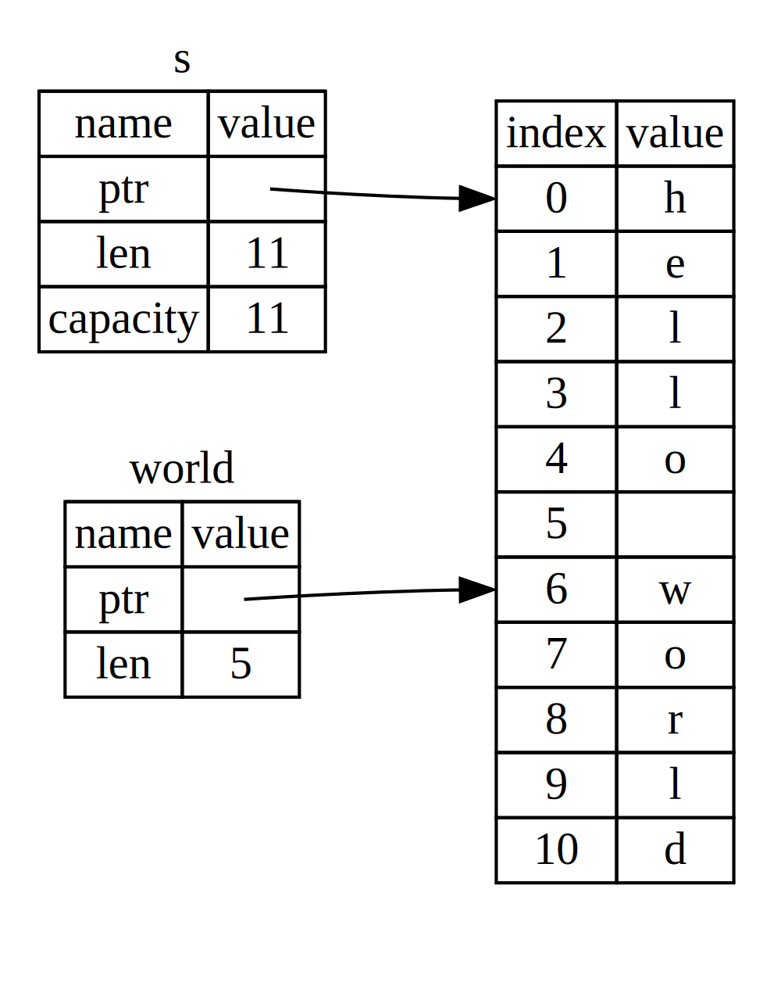

## 引用与借用

[ch04-02-references-and-borrowing.md](https://github.com/rust-lang/book/blob/bb86b1763bdfb823e3e1d52c57020543b0fc7c4a/src/ch04-02-references-and-borrowing.md)

示例 4-5 中的元组代码有这样一个问题：我们必须把 `String` 返回给调用函数，这样在调用 `calculate_length` 之后仍然能使用它，因为 `String` 已经被移动进了 `calculate_length`。另一种做法是提供 `String` 值的引用（reference）。**引用**（*reference*）有点像指针，因为它是一个地址，我们可以沿着它访问存储在该地址中的数据，而这些数据归其他变量所有。与指针不同，引用在其生命周期内保证会指向某个特定类型的有效值。

下面是如何定义并使用一个（新的）`calculate_length` 函数，它以一个对象的引用作为参数而不是获取值的所有权：

<span class="filename">文件名：src/main.rs</span>

```rust
{{#rustdoc_include ../listings/ch04-understanding-ownership/no-listing-07-reference/src/main.rs:all}}
```

首先，注意变量声明和函数返回值中的元组代码都消失了。其次，注意我们把 `&s1` 传给 `calculate_length`，而在函数定义中，我们接收的是 `&String` 而不是 `String`。这些 `&` 符号表示 **引用**；它们让你引用某个值而不取得它的所有权。图 4-6 展示了这一概念。



<span class="caption">图 4-6：`&String s` 指向 `String s1` 示意图</span>

> 注意：与使用 `&` 引用相反的操作是 **解引用**（*dereferencing*），它使用解引用运算符 `*` 实现。我们将会在第八章遇到一些解引用运算符，并在第十五章详细讨论解引用。

仔细看看这个函数调用：

```rust
{{#rustdoc_include ../listings/ch04-understanding-ownership/no-listing-07-reference/src/main.rs:here}}
```

`&s1` 语法让我们创建一个**指向**值 `s1` 的引用，但并不拥有它。因为这个引用并不拥有该值，所以当引用停止使用时，它所指向的值也不会被丢弃。

同理，函数签名使用 `&` 来表明参数 `s` 的类型是一个引用。让我们增加一些解释性的注释：

```rust
{{#rustdoc_include ../listings/ch04-understanding-ownership/no-listing-08-reference-with-annotations/src/main.rs:here}}
```

变量 `s` 的有效作用域与其他函数参数相同，不过当 `s` 停止使用时，它所指向的值不会被丢弃，因为 `s` 并不拥有它。当函数把引用而不是实际值作为参数时，就不需要通过返回值来交还所有权，因为函数从未拥有过它。

我们将创建一个引用的行为称为 **借用**（*borrowing*）。正如现实生活中，如果一个人拥有某样东西，你可以从他那里借来。当你使用完后，必须还回去。因为我们并不拥有它的所有权。

那如果我们尝试修改借用的变量呢？尝试示例 4-6 中的代码。剧透：这行不通！

<span class="filename">文件名：src/main.rs</span>

```rust,ignore,does_not_compile
{{#rustdoc_include ../listings/ch04-understanding-ownership/listing-04-06/src/main.rs}}
```

<span class="caption">示例 4-6：尝试修改借用的值</span>

这里是错误：

```console
{{#include ../listings/ch04-understanding-ownership/listing-04-06/output.txt}}
```

正如变量默认是不可变的，引用默认也是不可变的。我们不允许通过引用修改它指向的值。

### 可变引用

我们通过一个小调整就能修复示例 4-6 代码中的错误，允许我们修改一个借用的值，这就是 **可变引用**（*mutable reference*）：

<span class="filename">文件名：src/main.rs</span>

```rust
{{#rustdoc_include ../listings/ch04-understanding-ownership/no-listing-09-fixes-listing-04-06/src/main.rs}}
```

首先，我们必须把 `s` 改成 `mut`。然后在调用 `change` 函数时创建一个可变引用 `&mut s`，并更新函数签名，让它接收一个可变引用 `some_string: &mut String`。这样就很清楚地表明，`change` 函数会修改它所借用的值。

可变引用有一个很大的限制：如果你有一个对该变量的可变引用，你就不能再创建对该变量的引用。这些尝试创建两个 `s` 的可变引用的代码会失败：

<span class="filename">文件名：src/main.rs</span>

```rust,ignore,does_not_compile
{{#rustdoc_include ../listings/ch04-understanding-ownership/no-listing-10-multiple-mut-not-allowed/src/main.rs:here}}
```

错误如下：

```console
{{#include ../listings/ch04-understanding-ownership/no-listing-10-multiple-mut-not-allowed/output.txt}}
```

这个报错说明这段代码无效，因为我们不能在同一时间多次以可变方式借用 `s`。第一个可变借用在 `r1` 中，并且必须持续到它在 `println!` 中被使用；但在这个可变引用被创建和被使用之间，我们又尝试在 `r2` 中创建另一个可变引用，它借用的是和 `r1` 相同的数据。

这一限制让可变性以一种受到严格控制的方式出现，从而防止在同一时间对同一数据存在多个可变引用。刚接触 Rust 的人往往不太适应这一点，因为大多数语言都允许你随时修改变量。这个限制的好处是 Rust 可以在编译时防止数据竞争。**数据竞争**（*data race*）类似于竞态条件，它会在以下三种行为同时发生时出现：

- 两个或更多指针同时访问同一数据。
- 至少有一个指针被用来写入数据。
- 没有同步数据访问的机制。

数据竞争会导致未定义行为，难以在运行时追踪，并且难以诊断和修复；Rust 通过拒绝编译存在数据竞争的代码来避免此问题！

一如既往，可以使用大括号来创建一个新的作用域，以允许拥有多个可变引用，只是不能**同时**拥有：

```rust
{{#rustdoc_include ../listings/ch04-understanding-ownership/no-listing-11-muts-in-separate-scopes/src/main.rs:here}}
```

Rust 在同时使用可变与不可变引用时也强制采用类似的规则。这些代码会导致一个错误：

```rust,ignore,does_not_compile
{{#rustdoc_include ../listings/ch04-understanding-ownership/no-listing-12-immutable-and-mutable-not-allowed/src/main.rs:here}}
```

错误如下：

```console
{{#include ../listings/ch04-understanding-ownership/no-listing-12-immutable-and-mutable-not-allowed/output.txt}}
```

呼！我们**也**不能在拥有不可变引用的同时拥有可变引用。

不可变引用的借用者可不希望在借用时值会突然发生改变！然而，多个不可变引用是可以的，因为没有哪个只能读取数据的引用者能够影响其他引用者读取到的数据。

注意一个引用的作用域从声明的地方开始一直持续到最后一次使用为止。例如，因为最后一次使用不可变引用的位置在 `println!`，它发生在声明可变引用之前，所以如下代码是可以编译的：

```rust
{{#rustdoc_include ../listings/ch04-understanding-ownership/no-listing-13-reference-scope-ends/src/main.rs:here}}
```

不可变引用 `r1` 和 `r2` 的作用域在 `println!` 最后一次使用之后结束，这发生在可变引用 `r3` 被创建之前。因为它们的作用域没有重叠，所以代码是可以编译的。编译器可以在作用域结束之前判断不再使用的引用。

尽管借用错误有时令人沮丧，但请记住，这是 Rust 编译器在提前指出一个潜在 bug，并且精确告诉你问题出在哪里，而且这一切发生在编译时而不是运行时。这样你就不必再去追查，为什么数据的状态和你原先想的不一样。

### 悬垂引用

在带有指针的语言中，如果释放了一块内存，却保留了指向它的指针，就很容易错误地制造出一个**悬垂指针**（*dangling pointer*）：这个指针指向的内存位置可能已经被分配作其他用途。相比之下，在 Rust 中，编译器保证引用永远不会变成悬垂引用：如果你持有某些数据的引用，编译器会确保这些数据不会在它们的引用之前离开作用域。

让我们尝试创建一个悬垂引用，看看 Rust 如何通过一个编译时错误来防止它：

<span class="filename">文件名：src/main.rs</span>

```rust,ignore,does_not_compile
{{#rustdoc_include ../listings/ch04-understanding-ownership/no-listing-14-dangling-reference/src/main.rs}}
```

这里是错误：

```console
{{#include ../listings/ch04-understanding-ownership/no-listing-14-dangling-reference/output.txt}}
```

这条错误信息提到了一个我们还没有讲到的特性：生命周期（lifetimes）。第十章会详细讨论生命周期。不过，即使先不理会和生命周期相关的部分，这条错误信息里也已经包含了说明这段代码为何有问题的关键信息：

```text
this function's return type contains a borrowed value, but there is no value
for it to be borrowed from
```

让我们仔细看看我们的 `dangle` 代码的每个阶段到底发生了什么：

<span class="filename">文件名：src/main.rs</span>

```rust,ignore,does_not_compile
{{#rustdoc_include ../listings/ch04-understanding-ownership/no-listing-15-dangling-reference-annotated/src/main.rs:here}}
```

因为 `s` 是在 `dangle` 函数内部创建的，所以当 `dangle` 的代码执行完毕后，`s` 就会被释放。但我们却尝试返回对它的引用。这意味着这个引用将指向一个无效的 `String`，这显然不对！Rust 不允许我们这么做。

这里的解决方法是直接返回 `String`：

```rust
{{#rustdoc_include ../listings/ch04-understanding-ownership/no-listing-16-no-dangle/src/main.rs:here}}
```

这样就没有任何错误了。所有权被移动出去，所以没有值被释放。

### 引用的规则

让我们概括一下之前对引用的讨论：

* 在任意给定时间，**要么**只能有一个可变引用，**要么**只能有多个不可变引用。
* 引用必须总是有效的。

接下来，我们来看看另一种不同类型的引用：slice。
