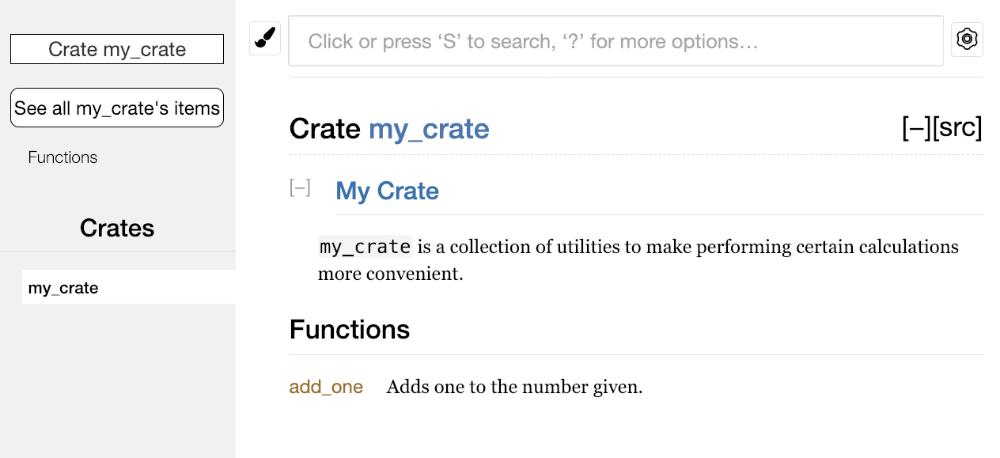

## 将 crate 发布到 Crates.io

[ch14-02-publishing-to-crates-io.md](https://github.com/rust-lang/book/blob/43b9ad334aaf7353e5708dba49f84f941b50ec4b/src/ch14-02-publishing-to-crates-io.md)

我们曾经在项目中使用 [crates.io](https://crates.io)<!-- ignore --> 上的包作为依赖，不过你也可以通过发布自己的包来向他人分享代码。[crates.io](https://crates.io)<!-- ignore --> 上的 crate 注册表会分发你包的源代码，因此它主要托管开源代码。

Rust 和 Cargo 提供了一些功能，让你发布的包更容易被他人找到和使用。接下来我们会介绍其中一些功能，然后说明如何发布包。

### 编写有用的文档注释

准确的包文档有助于其他用户理解如何以及何时使用它们，所以花一些时间编写文档是值得的。第三章中我们讨论了如何使用双斜杠 `//` 注释 Rust 代码。Rust 也有特定的用于文档的注释类型，通常被称为**文档注释**（*documentation comments*），它们会生成 HTML 文档。这些 HTML 展示公有 API 文档注释的内容，它们意在让对库感兴趣的程序员理解如何**使用**这个 crate，而不是它是如何被**实现**的。

文档注释使用三条斜杠 `///`，而不是两条斜杠，并且支持使用 Markdown 标记来格式化文本。将文档注释放在它所说明的项之前。示例 14-1 展示了名为 `my_crate` 的 crate 中一个 `add_one` 函数的文档注释。

<span class="filename">文件名：src/lib.rs</span>

```rust,ignore
{{#rustdoc_include ../listings/ch14-more-about-cargo/listing-14-01/src/lib.rs}}
```

<span class="caption">示例 14-1：一个函数的文档注释</span>

这里，我们描述了 `add_one` 函数的功能，接着以 `Examples` 为标题开始了一个小节，并给出了展示如何使用 `add_one` 函数的代码。可以运行 `cargo doc` 来根据这些文档注释生成 HTML 文档。这个命令会运行 Rust 自带的 `rustdoc` 工具，并将生成的 HTML 文档放到 *target/doc* 目录中。

为了方便起见，运行 `cargo doc --open` 会为当前 crate 的文档构建 HTML（以及它所有依赖的文档），并在浏览器中打开结果。定位到 `add_one` 函数时，你会看到文档注释中的文本是如何被渲染的，如图 14-1 所示：


<span class="caption">图 14-1：`add_one` 函数的文档注释 HTML</span>

#### 常用章节

示例 14-1 中使用了 `# Examples` Markdown 标题在 HTML 中创建了一个以 “Examples” 为标题的部分。其他一些 crate 作者经常在文档注释中使用的部分有：

- **Panics**：函数在什么情况下可能会 `panic!`。不希望程序 panic 的调用者应确保不会在这些情况下调用该函数。
- **Errors**：如果函数返回 `Result`，说明可能出现哪些错误，以及什么条件会导致返回这些错误，会有助于调用者编写代码，以不同方式处理不同种类的错误。
- **Safety**：如果调用该函数是 `unsafe` 的（我们会在第二十章讨论不安全代码），这里应解释为什么它是不安全的，并说明函数要求调用者维持哪些不变式。

大多数文档注释不需要包含所有这些章节，但这是一份很好的检查清单，可以提醒你关注用户会想了解的内容。

#### 文档注释作为测试

在文档注释中添加示例代码块，有助于展示如何使用你的库，而且还有一个额外的好处：运行 `cargo test` 时，文档中的示例代码也会作为测试运行！没有什么比带示例的文档更好了，但也没有什么比示例失效的文档更糟糕了。如果我们对示例 14-1 中 `add_one` 函数的文档运行 `cargo test`，会在测试结果中看到如下内容：

```text
   Doc-tests my_crate

running 1 test
test src/lib.rs - add_one (line 5) ... ok

test result: ok. 1 passed; 0 failed; 0 ignored; 0 measured; 0 filtered out; finished in 0.27s
```

现在，如果我们修改函数或示例中的任意一方，使示例里的 `assert_eq!` 触发 panic，然后再次运行 `cargo test`，就会看到文档测试捕获到了示例与代码不同步的问题！

#### 注释包含项的结构

`//!` 这种文档注释风格为“包含这些注释的项”添加文档，而不是为“位于这些注释之后的项”添加文档。我们通常在 crate 根文件（按惯例是 _src/lib.rs_）或模块内部使用这种文档注释，为整个 crate 或整个模块编写说明。

例如，为了添加描述包含 `add_one` 函数的 `my_crate` crate 的用途的文档，我们可以在 _src/lib.rs_ 文件开头加入以 `//!` 开头的文档注释，如示例 14-2 所示：

<span class="filename">文件名：src/lib.rs</span>

```rust,ignore
{{#rustdoc_include ../listings/ch14-more-about-cargo/listing-14-02/src/lib.rs:here}}
```

<span class="caption">示例 14-2：`my_crate` crate 整体的文档</span>

注意，最后一行以 `//!` 开头的注释后面没有任何代码。因为我们使用的是 `//!` 而不是 `///`，所以这里记录的是“包含这条注释的项”的文档，而不是“紧随这条注释之后的项”的文档。在这里，这个项就是 *src/lib.rs* 文件，也就是 crate 根。这些注释描述的是整个 crate。

运行 `cargo doc --open` 后，这些注释会显示在 `my_crate` 文档首页的 crate 公有项列表上方，如图 14-2 所示：



<span class="caption">图 14-2：包含 `my_crate` 整体描述的注释所渲染的文档</span>

项内部的文档注释特别适合用来描述 crate 和模块。使用它们来解释这个容器整体的目的，可以帮助用户理解 crate 的组织方式。

### 导出实用的公有 API

公有 API 的结构是你发布 crate 时主要需要考虑的。crate 用户没有你那么熟悉其结构，并且如果模块层级过大他们可能会难以找到所需的部分。

第七章介绍了如何使用 `pub` 关键字使项公开，以及如何使用 `use` 关键字将项引入作用域。不过，在你开发 crate 时对你来说合理的结构，对用户而言可能并不方便。你可能想把结构体组织成一个包含多层的层级结构，但想使用你定义在深层级中的某个类型的人，可能很难发现它的存在。他们也可能会厌烦不得不写 `use my_crate::some_module::another_module::UsefulType;`，而不是更简单的 `use my_crate::UsefulType;`。

好消息是，如果这种结构对外部用户来说并不方便，你也不必重新安排内部组织。你可以使用 `pub use` 来重导出项，从而建立一个与私有结构不同的公有结构。*重导出（re-export）* 会把某个位置的公有项在另一个位置再次公开，就好像它原本就定义在那里一样。

例如，假设我们创建了一个名为 `art` 的库，用来建模艺术概念。在这个库里，有两个模块：`kinds` 模块包含两个枚举 `PrimaryColor` 和 `SecondaryColor`，`utils` 模块包含一个名为 `mix` 的函数，如示例 14-3 所示：

<span class="filename">文件名：src/lib.rs</span>

```rust,noplayground,test_harness
{{#rustdoc_include ../listings/ch14-more-about-cargo/listing-14-03/src/lib.rs:here}}
```

<span class="caption">示例 14-3：一个库 `art` 其组织包含 `kinds` 和 `utils` 模块</span>

图 14-3 展示了 `cargo doc` 为这个 crate 生成的文档首页。


<span class="caption">图 14-3：包含 `kinds` 和 `utils` 模块的库 `art` 的文档首页</span>

注意 `PrimaryColor` 和 `SecondaryColor` 类型、以及 `mix` 函数都没有在首页中列出。我们必须点击 `kinds` 或 `utils` 才能看到它们。

依赖这个库的另一个 crate 需要使用 `use` 语句，把 `art` 中的项引入作用域，同时必须指定当前定义的模块结构。示例 14-4 展示了一个使用 `art` crate 中 `PrimaryColor` 和 `mix` 的 crate：

<span class="filename">文件名：src/main.rs</span>

```rust,ignore
{{#rustdoc_include ../listings/ch14-more-about-cargo/listing-14-04/src/main.rs}}
```

<span class="caption">示例 14-4：一个通过导出内部结构使用 `art` crate 中项的 crate</span>

示例 14-4 中这段代码的作者，必须先弄清楚 `PrimaryColor` 在 `kinds` 模块中，而 `mix` 在 `utils` 模块中。`art` crate 的模块结构，对开发 `art` crate 的人来说比对使用它的人更有意义。这种内部结构并没有给想理解如何使用 `art` crate 的人提供有价值的信息，反而会带来困惑，因为用户必须先搞清楚该去哪里找需要的内容，还要在 `use` 语句中写出模块名。

为了从公有 API 中去掉内部组织细节，我们可以修改示例 14-3 中的 `art` crate，加入 `pub use` 语句，在顶层重导出这些项，如示例 14-5 所示：

<span class="filename">文件名：src/lib.rs</span>

```rust,ignore
{{#rustdoc_include ../listings/ch14-more-about-cargo/listing-14-05/src/lib.rs:here}}
```

<span class="caption">示例 14-5：增加 `pub use` 语句重导出项</span>

现在，`cargo doc` 为这个 crate 生成的 API 文档会在首页列出这些重导出项及其链接，如图 14-4 所示，这使 `PrimaryColor`、`SecondaryColor` 和 `mix` 更容易被找到。


<span class="caption">图 14-4：列出重导出项的 `art` 文档首页</span>

`art` crate 的用户仍然可以像示例 14-4 那样看到并使用示例 14-3 中的内部结构，也可以使用示例 14-5 中更方便的结构，如示例 14-6 所示：

<span class="filename">文件名：src/main.rs</span>

```rust,ignore
{{#rustdoc_include ../listings/ch14-more-about-cargo/listing-14-06/src/main.rs:here}}
```

<span class="caption">示例 14-6：一个使用 `art` crate 中重导出项的程序</span>

在存在很多嵌套模块的情况下，使用 `pub use` 将类型重导出到顶层，会显著改善使用这个 crate 的体验。`pub use` 的另一个常见用法，是把当前 crate 的某个依赖中的定义重新导出，让那个 crate 的定义成为你这个 crate 公有 API 的一部分。

创建有用的公有 API 结构更像是一门艺术，而不是科学；你可以不断迭代，找到最适合用户的 API。选择 `pub use` 能让你在 crate 内部结构的组织方式上保持灵活，并将其与你呈现给用户的结构解耦。可以看看你安装过的一些 crate 的源码，观察它们的内部结构是否和公有 API 不同。

### 创建 Crates.io 账号

在发布任何 crate 之前，你需要在 [crates.io](https://crates.io)<!-- ignore --> 上创建账号并获取一个 API token。为此，请访问 [crates.io](https://crates.io)<!-- ignore --> 首页，并通过 GitHub 账号登录。（目前 GitHub 账号仍然是必需的，不过未来这个网站可能会支持其他注册方式。）登录之后，前往 [https://crates.io/me/](https://crates.io/me/)<!-- ignore --> 的账户设置页面获取 API key。然后运行 `cargo login` 命令，并在提示时粘贴你的 API key，如下所示：

```console
$ cargo login
abcdefghijklmnopqrstuvwxyz012345
```

这个命令会把你的 API token 告诉 Cargo，并将其保存在本地的 *~/.cargo/credentials* 文件中。注意，这个 token 是一个**秘密**，不应该与任何人共享。如果你因为任何原因泄露了它，应立即到 [crates.io](https://crates.io)<!-- ignore --> 撤销并重新生成一个 token。

### 向新 crate 添加元数据

比如说你已经有一个希望发布的 crate。在发布之前，你需要在 crate 的 *Cargo.toml* 文件的 `[package]` 部分增加一些本 crate 的元数据（metadata）。

首先，crate 需要一个唯一的名称。虽然在本地开发 crate 时，你可以随意命名，但 [crates.io](https://crates.io)<!-- ignore --> 上的 crate 名称遵循先到先得的原则。一旦某个 crate 名称已经被占用，就没有其他人能再用这个名称发布 crate。请搜索你想使用的名称，确认它是否已被占用。如果没有，就把 _Cargo.toml_ 中 `[package]` 里的 `name` 字段改成你想发布时使用的名称，如下所示：

<span class="filename">文件名：Cargo.toml</span>

```toml
[package]
name = "guessing_game"
```

即使你选择了一个唯一的名称，如果此时尝试运行 `cargo publish` 发布该 crate 的话，会得到一个警告接着是一个错误：

```console
$ cargo publish
    Updating crates.io index
warning: manifest has no description, license, license-file, documentation, homepage or repository.
See https://doc.rust-lang.org/cargo/reference/manifest.html#package-metadata for more info.
--snip--
error: failed to publish to registry at https://crates.io

Caused by:
  the remote server responded with an error (status 400 Bad Request): missing or empty metadata fields: description, license. Please see https://doc.rust-lang.org/cargo/reference/manifest.html for more information on configuring these fields
```

这个错误是因为我们缺少一些关键信息：关于该 crate 用途的描述，以及用户可以在什么许可条款下使用它。在 _Cargo.toml_ 中添加一两句简短描述即可，因为它会在搜索结果中和你的 crate 一起显示。对于 `license` 字段，你需要填写一个**许可证标识符值**（*license identifier value*）。[Linux 基金会的 Software Package Data Exchange (SPDX)][spdx] 列出了可用的标识符。例如，如果要指定 crate 使用 MIT License，就添加 `MIT` 标识符：

<span class="filename">文件名：Cargo.toml</span>

```toml
[package]
name = "guessing_game"
license = "MIT"
```

如果你想使用 SPDX 中不存在的许可证，就需要把许可证文本放入一个文件中，将该文件包含到项目里，然后使用 `license-file` 指定该文件名，而不是使用 `license` 字段。

关于项目应采用何种许可证的建议超出了本书的范围。很多 Rust 社区成员选择与 Rust 本身相同的许可证，也就是双许可证 `MIT OR Apache-2.0`。这个例子也说明了，你可以用 `OR` 分隔多个许可证标识符，来为项目指定多个许可证。

那么，有了唯一的名称、版本号、由 `cargo new` 新建项目时增加的作者信息、描述和所选择的 license，已经准备好发布的项目的 *Cargo.toml* 文件可能看起来像这样：

<span class="filename">文件名：Cargo.toml</span>

```toml
[package]
name = "guessing_game"
version = "0.1.0"
edition = "2024"
description = "A fun game where you guess what number the computer has chosen."
license = "MIT OR Apache-2.0"

[dependencies]
```

[Cargo 文档](https://doc.rust-lang.org/cargo/) 还描述了其他可指定的元数据，它们可以帮助你的 crate 更容易被发现和使用！

### 发布到 Crates.io

现在，我们已经创建了账号、保存了 API token、为 crate 选好了名字，并填入了所需的元数据，你就可以发布了！发布 crate 会将该 crate 的某个特定版本上传到 [crates.io](https://crates.io)<!-- ignore --> 供他人使用。

发布 crate 时务必小心，因为发布是**永久性的**。对应版本无法被覆盖，其代码也无法被删除。[crates.io](https://crates.io)<!-- ignore --> 的一个主要目标，是充当代码的永久归档服务器，这样所有依赖 [crates.io](https://crates.io)<!-- ignore --> 上 crate 的项目都能一直正常工作。而如果允许删除版本，就无法实现这一目标。不过，可发布的版本号数量并没有限制。

再次运行 `cargo publish` 命令。这次它应该会成功：

```console
$ cargo publish
    Updating crates.io index
   Packaging guessing_game v0.1.0 (file:///projects/guessing_game)
   Verifying guessing_game v0.1.0 (file:///projects/guessing_game)
   Compiling guessing_game v0.1.0
(file:///projects/guessing_game/target/package/guessing_game-0.1.0)
    Finished `dev` profile [unoptimized + debuginfo] target(s) in 0.19s
   Uploading guessing_game v0.1.0 (file:///projects/guessing_game)
```

至此，你已经把代码分享给 Rust 社区了，任何人都可以轻松地把你的 crate 加入自己的项目依赖中。

### 发布现有 crate 的新版本

当你修改了 crate 并准备发布新版本时，修改 *Cargo.toml* 中 `version` 的值。请使用[语义化版本控制规则][semver]，根据修改的类型决定下一个版本号。然后再次运行 `cargo publish` 来上传新版本。

### 使用 `cargo yank` 从 Crates.io 撤回版本

虽然你不能删除 crate 的历史版本，但可以阻止未来的新项目把它加入依赖。这在某个版本因为某种原因损坏时会很有用。为此，Cargo 支持对某个版本执行**撤回**（*yank*）。

**撤回**某个版本会阻止新项目依赖这个版本，不过所有已经依赖它的项目仍然可以下载并继续依赖它。从本质上说，撤回意味着：所有已有 *Cargo.lock* 的项目都不会因此损坏，而任何新生成的 *Cargo.lock* 都不会再使用被撤回的版本。

要撤回 crate 的某个版本，请在之前发布该 crate 的目录中运行 `cargo yank`，并指定要撤回的版本。例如，如果我们发布了名为 `guessing_game` 的 crate 的 `1.0.1` 版本，并想撤回它，就在 `guessing_game` 项目目录中运行：

```console
$ cargo yank --vers 1.0.1
    Updating crates.io index
        Yank guessing_game@1.0.1
```

你也可以撤销这次撤回，让项目重新可以依赖该版本，只需在命令中加上 `--undo`：

```console
$ cargo yank --vers 1.0.1 --undo
    Updating crates.io index
      Unyank guessing_game@1.0.1
```

撤回**不会**删除任何代码。例如，撤回功能并不能删除你不小心上传的秘密信息。如果发生了这种情况，请立刻轮换这些秘密信息。

[spdx]: https://spdx.org/licenses/
[semver]: https://semver.org/
