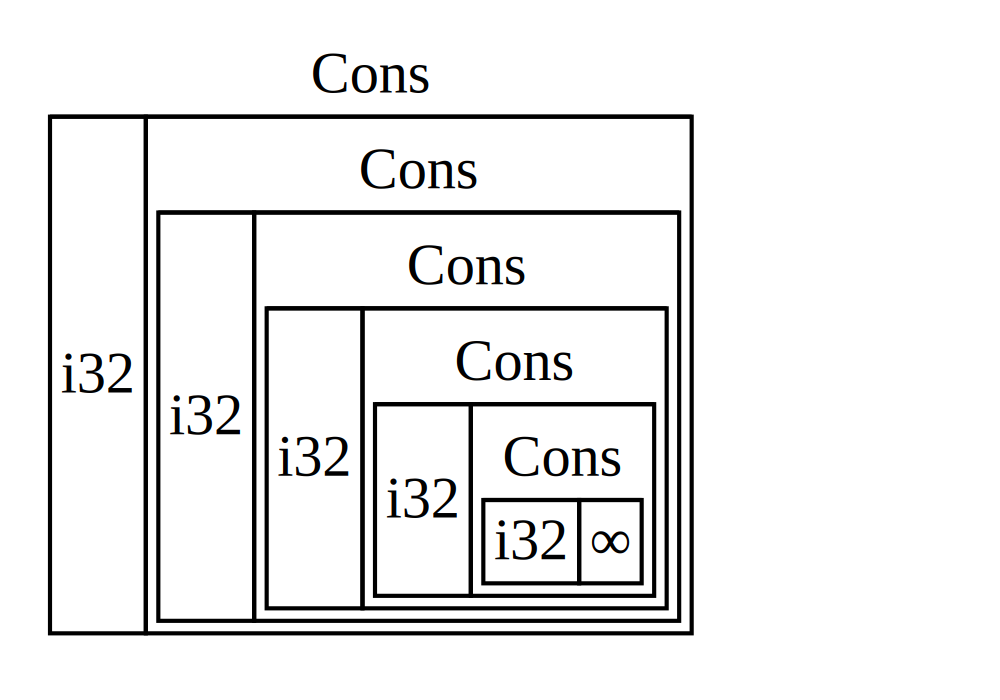

## 使用 `Box<T>` 指向堆上的数据

[ch15-01-box.md](https://github.com/rust-lang/book/blob/ecef81cbc6f0c2d1c8a67409329b0641258c04c2/src/ch15-01-box.md)

最简单直接的智能指针是 box，其类型写作 `Box<T>`。Box 允许你将数据存储在堆上而不是栈上。留在栈上的则是指向堆数据的指针。如果你想回顾一下栈和堆之间的区别，可以参考第四章。

除了把数据存储在堆上而不是栈上之外，box 没有性能开销。不过，它们也没有太多额外能力。你最常在以下这些场景中使用它们：

- 当有一个在编译时未知大小的类型，而又想要在需要确切大小的上下文中使用这个类型值的时候
- 当有大量数据并希望在确保数据不被拷贝的情况下转移所有权的时候
- 当希望拥有一个值并只关心它的类型是否实现了特定 trait 而不是其具体类型的时候

我们会在[“Box 允许创建递归类型”](#box-允许创建递归类型)一节中展示第一种场景。在第二种情况下，转移大量数据的所有权可能会花费很长时间，因为数据会在栈上被复制。为了改善这种场景下的性能，我们可以把大量数据放进 box 中存储到堆上。这样，只有少量指针数据会在栈上被复制，而它所指向的数据则会一直留在堆上的同一位置。第三种情况被称为**trait 对象**（*trait object*），第十八章中的[“使用 trait 对象来抽象共享行为”][trait-objects]专门讨论了这个主题。所以你在这里学到的内容，还会在那一节中再次用到！

### 在堆上存储数据

在讨论 `Box<T>` 的堆存储用例之前，让我们熟悉一下语法以及如何与存储在 `Box<T>` 中的值进行交互。

示例 15-1 展示了如何使用 box 在堆上存储一个 `i32` 值。

<span class="filename">文件名：src/main.rs</span>

```rust
{{#rustdoc_include ../listings/ch15-smart-pointers/listing-15-01/src/main.rs}}
```

<span class="caption">示例 15-1：使用 box 在堆上储存一个 `i32` 值</span>

我们将变量 `b` 定义为一个 `Box`，它指向值 `5`，而这个值被分配在堆上。这个程序会打印 `b = 5`；在这个例子里，我们访问 box 中数据的方式，和数据位于栈上时的方式类似。和任何拥有所有权的值一样，当 box 离开作用域时，就像 `b` 在 `main` 结束时那样，它会被释放。释放时既会清理 box 本身（存储在栈上），也会清理它指向的数据（存储在堆上）。

把单个值放到堆上并没有太大意义，所以你不会经常像示例 15-1 那样单独使用 box。对于像单个 `i32` 这样的值来说，把它们放在默认存储位置栈上，在大多数情况下更合适。接下来，我们来看一个如果没有 box 就无法定义的类型。

### Box 允许创建递归类型

**递归类型**（_recursive type_）的值可以拥有另一个同类型的值作为其自身的一部分。但是这会产生一个问题，因为 Rust 需要在编译时知道类型占用多少空间。递归类型的值嵌套理论上可以无限地进行下去，所以 Rust 不知道递归类型需要多少空间。因为 box 有一个已知的大小，所以通过在递归类型定义中插入 box，就可以创建递归类型了。

作为递归类型的例子，让我们来看看 cons list。这是一种在函数式编程语言中常见的数据类型。我们将定义的 cons list 除了递归之外都很简单，因此这个例子里的概念，在你遇到更复杂的递归类型场景时也会很有用。

#### 理解 cons list

cons list 是一种来自 Lisp 编程语言及其方言的数据结构，由嵌套的 pair 组成，也是 Lisp 版本的链表。它的名字来源于 Lisp 中的 `cons` 函数（即 *construct function* 的缩写），这个函数用它的两个参数构造一个新的 pair。通过对一个由某个值和另一个 pair 组成的 pair 调用 `cons`，我们就能构造出由递归 pair 组成的 cons list。

例如这里有一个包含列表 `1, 2, 3` 的 cons list 的伪代码表示，其每个对在一个括号中：

```text
(1, (2, (3, Nil)))
```

cons list 中的每一项都包含两个元素：当前项的值，以及下一项。列表中的最后一项只包含一个名为 `Nil` 的值，而没有下一项。cons list 是通过递归调用 `cons` 函数构造出来的。用来表示递归基例的规范名称是 `Nil`。注意，这和第六章讨论过的 “null” 或 “nil” 概念并不相同，后者表示无效或缺失的值。

cons list 并不是一个 Rust 中常见的类型。大部分在 Rust 中需要列表的时候，`Vec<T>` 是一个更好的选择。其他更为复杂的递归数据类型**确实**在 Rust 的很多场景中很有用，不过通过以 cons list 作为开始，我们可以探索如何使用 box 毫不费力地定义一个递归数据类型。

示例 15-2 包含一个 cons list 的枚举定义。注意这还不能编译因为这个类型没有已知的大小，之后我们会展示：

<span class="filename">文件名：src/main.rs</span>

```rust,ignore,does_not_compile
{{#rustdoc_include ../listings/ch15-smart-pointers/listing-15-02/src/main.rs:here}}
```

<span class="caption">示例 15-2：第一次尝试定义一个代表 `i32` 值的 cons list 数据结构的枚举</span>

> 注意：出于示例的需要我们选择实现一个只存放 `i32` 值的 cons list。也可以用泛型，正如第十章讲到的，来定义一个可以存放任何类型值的 cons list 类型。

使用这个 cons list 来储存列表 `1, 2, 3` 将看起来如示例 15-3 所示：

<span class="filename">文件名：src/main.rs</span>

```rust,ignore,does_not_compile
{{#rustdoc_include ../listings/ch15-smart-pointers/listing-15-03/src/main.rs:here}}
```

<span class="caption">示例 15-3：使用 `List` 枚举储存列表 `1, 2, 3`</span>

第一个 `Cons` 储存了 `1` 和另一个 `List` 值。这个 `List` 是另一个包含 `2` 的 `Cons` 值和下一个 `List` 值。接着又有另一个存放了 `3` 的 `Cons` 值和最后一个值为 `Nil` 的 `List`，非递归变体代表了列表的结尾。

如果尝试编译示例 15-3 的代码，会得到如示例 15-4 所示的错误：

```console
{{#include ../listings/ch15-smart-pointers/listing-15-03/output.txt}}
```

<span class="caption">示例 15-4：尝试定义一个递归枚举时得到的错误</span>

这个错误表明，这个类型“有无限大小”。原因在于，我们把 `List` 的一个变体定义成了递归的：它直接持有另一个同类型的值。因此，Rust 无法判断存储一个 `List` 值到底需要多少空间。让我们拆开看看为什么会出现这个错误。首先，先来看看 Rust 是如何决定存储非递归类型的值需要多少空间的。

#### 计算非递归类型的大小

回忆一下第六章讨论枚举定义时示例 6-2 中定义的 `Message` 枚举：

```rust
{{#rustdoc_include ../listings/ch06-enums-and-pattern-matching/listing-06-02/src/main.rs:here}}
```

当 Rust 需要知道要为 `Message` 值分配多少空间时，它可以检查每一个变体并发现 `Message::Quit` 并不需要任何空间，`Message::Move` 需要足够储存两个 `i32` 值的空间，依此类推。因为 enum 实际上只会使用其中的一个变体，所以 `Message` 值所需的空间等于储存其最大变体的空间大小。

与之相对的是，当 Rust 试图确定像示例 15-2 中 `List` 枚举这样的递归类型需要多少空间时，会发生什么。编译器先查看 `Cons` 变体，它持有一个 `i32` 类型的值和一个 `List` 类型的值。因此，`Cons` 所需的空间等于一个 `i32` 的大小再加上一个 `List` 的大小。为了算出 `List` 类型需要多少内存，编译器又要继续查看它的变体，并再次从 `Cons` 开始。`Cons` 又持有一个 `i32` 和一个 `List`，这个过程就会无限持续下去，如图 15-1 所示：



<span class="caption">图 15-1：一个包含无限个 `Cons` 变体的无限 `List`</span>

#### 获取一个已知大小的给递归类型

因为 Rust 无法计算出要为定义为递归的类型分配多少空间，所以编译器给出了一个包括了有用建议的错误：

```text
help: insert some indirection (e.g., a `Box`, `Rc`, or `&`) to break the cycle
  |
2 |     Cons(i32, Box<List>),
  |               ++++    +
```

在这里，_indirection_ 的意思是：不要直接存储一个值，而是通过存储一个指向该值的指针，间接地存储它。

因为 `Box<T>` 是一个指针，Rust 总是知道 `Box<T>` 需要多少空间：指针的大小并不会随它指向的数据量而变化。这意味着我们可以在 `Cons` 变体中放一个 `Box<T>`，而不是直接再放一个 `List` 值。这个 `Box<T>` 会指向下一个位于堆上的 `List` 值，而不是把这个 `List` 值直接放在 `Cons` 变体内部。从概念上说，我们仍然有一个“由列表组成的列表”，但现在这种实现更像是把这些项彼此相连，而不是一层层相互包含。

我们可以修改示例 15-2 中 `List` 枚举的定义和示例 15-3 中对 `List` 的应用，如示例 15-5 所示，这是可以编译的：

<span class="filename">文件名：src/main.rs</span>

```rust
{{#rustdoc_include ../listings/ch15-smart-pointers/listing-15-05/src/main.rs}}
```

<span class="caption">示例 15-5：为了拥有已知大小而使用 `Box<T>` 的 `List` 定义</span>

`Cons` 变体将会需要一个 `i32` 的大小加上储存 box 指针数据的空间。`Nil` 变体不储存值，所以它比 `Cons` 变体需要更少的空间。现在我们知道了任何 `List` 值最多需要一个 `i32` 加上 box 指针数据的大小。通过使用 box，打破了这无限递归的连锁，这样编译器就能够计算出储存 `List` 值需要的大小了。图 15-2 展示了现在 `Cons` 变体看起来像什么：


<span class="caption">图 15-2：因为 `Cons` 存放一个 `Box` 所以 `List` 不是无限大小的了</span>

Box 只提供间接存储和堆分配；它没有我们将在其他智能指针类型中看到的那些额外特殊能力。它也没有那些特殊能力带来的性能开销，因此在像 cons list 这样我们只需要“间接存储”这一特性的场景里，Box 就很有用。我们还会在第十八章看到更多 Box 的用例。

`Box<T>` 类型之所以是智能指针，是因为它实现了 `Deref` trait，这让 `Box<T>` 的值可以像引用一样被处理。当 `Box<T>` 的值离开作用域时，由于 `Drop` trait 的实现，box 指向的堆数据也会被清理掉。这两个 trait 对本章余下将讨论的其他智能指针类型所提供的功能会更加重要。接下来，我们更详细地看看这两个 trait。

[trait-objects]: ch18-02-trait-objects.html#顾及不同类型值的-trait-对象
